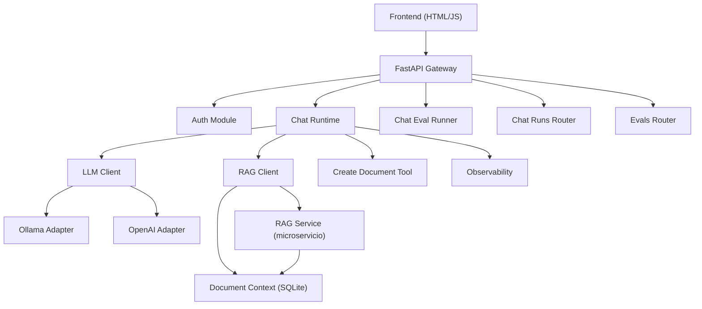
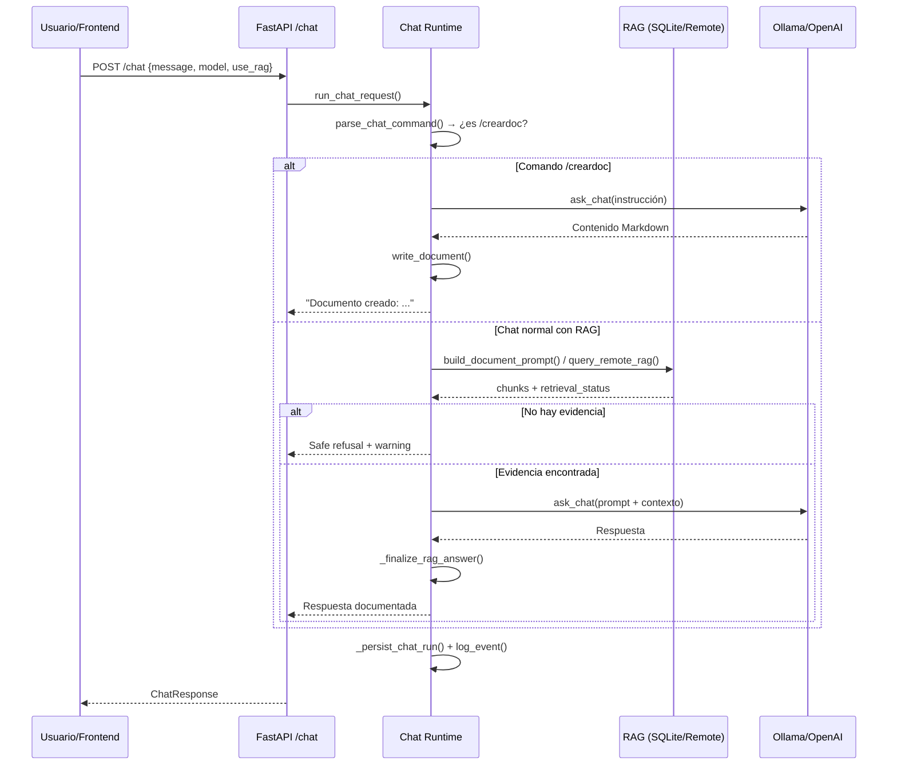

# Análisis del Repositorio LOCALES

## Visión General

**LOCALES** es un **gateway LLM local** (llamado *NúcleoChat*) construido con **FastAPI**. Permite hacer preguntas a modelos LLM locales (Ollama) o remotos (OpenAI), enriqueciéndolas opcionalmente con **RAG** (Retrieval-Augmented Generation) sobre una base documental SQLite. Incluye un frontend web, un sistema de evaluación, observabilidad, y herramientas de creación de documentos.

---

## 1. App Principal — [main.py](file:///home/jose-gonzalez-oliva/LOCALES/app/main.py)

| Función | Descripción |
|---|---|
| `_resolve_cors_allowed_origins()` | Resuelve los orígenes CORS permitidos: usa la configuración, o fallback a `localhost` en modo `local`/`dev`. |
| `_configure_cors(application)` | Configura el middleware CORS en la app FastAPI. |
| `log_rejected_cors_preflight()` | Middleware HTTP que loguea preflight CORS rechazados (status 400). |
| `_sync_chat_runtime_dependencies()` | Inyecta las dependencias reales (`ask_chat`, `build_document_prompt`, etc.) en el módulo `chat_runtime` para desacoplamiento. |
| `run_chat_request(request, persist_trace)` | Punto de entrada principal para procesar un `ChatRequest`. Sincroniza dependencias y delega a `chat_runtime`. |
| `_run_chat_request(request, persist_trace)` | Wrapper interno de `run_chat_request`. |
| `health()` | **GET `/health`** → Devuelve `{"status": "ok"}`. |
| `root()` | **GET `/`** → Info básica del servicio y links a docs. |
| `favicon()` | **GET `/favicon.ico`** → Devuelve 204 (sin contenido). |
| `chat_models()` | **GET `/api/models/chat`** → Lista todos los modelos de chat disponibles (Ollama + OpenAI). |
| `chat_options()` | **GET `/api/chat/options`** → Devuelve opciones de configuración de temperatura (presets). |
| `chat_trace_runs(limit)` | **GET `/api/traces/chat`** → Lista las últimas trazas de chat (con autenticación). |
| `chat_runs(limit)` | **GET `/api/chat/runs`** → Lista las últimas ejecuciones de chat. |
| `reset_chat_trace_runs()` | **POST `/api/traces/chat/reset`** → Borra todas las trazas de chat guardadas. |
| `chat_eval_runs(limit)` | **GET `/api/evals/chat`** → Lista las últimas evals de chat. |
| `saved_chat_eval_runs()` | **GET `/api/evals/runs`** → Lista las evals guardadas en disco. |
| `_execute_chat_eval_case(payload)` | Ejecuta un caso individual de evaluación. Valida el payload, lo pasa por `run_chat_request`, y normaliza el resultado. |
| `run_chat_eval_suite()` | **POST `/api/evals/chat/run`** → Ejecuta la suite completa de evaluación de chat. |
| `log_runtime_configuration()` | Hook `@app.on_event("startup")`. Loguea la configuración del runtime al arrancar. |
| `chat(request)` | **POST `/chat`** → Endpoint principal de chat. Requiere autenticación y procesa la petición completa. |

---

## 2. Chat Runtime — [chat_runtime.py](file:///home/jose-gonzalez-oliva/LOCALES/app/chat_runtime.py)

Motor principal de procesamiento de chat. ~1240 líneas.

| Función | Descripción |
|---|---|
| `_no_evidence_answer()` | Genera la respuesta estándar cuando no hay evidencia documental. |
| `_message_preview(text, limit)` | Trunca texto para previews en logs (máx 200 chars por defecto). |
| `parse_chat_command(message)` | Detecta si un mensaje comienza con `/creardoc` y extrae la instrucción. Devuelve `{"command": "creardoc", "instruction": ...}` o `None`. |
| `_chat_trace_source(user_id, chat_id)` | Devuelve la fuente de la traza (siempre `"chat"`). |
| `_strip_no_evidence_markers(answer)` | Limpia una respuesta eliminando los marcadores `NO_EVIDENCE_FOR_ANSWER`. |
| `_is_marker_only_no_evidence_answer(answer)` | Detecta si una respuesta contiene SOLO marcadores de "sin evidencia" (sin contenido real). |
| `_normalize_no_evidence_retrieval_status(value)` | Normaliza variantes del status de retrieval a `NO_EVIDENCE_FOR_ANSWER`. |
| `_clear_evidence_trace(context)` | Limpia los campos de evidencia (chunks, ids, filenames, scores) en el contexto. |
| `_evidence_used_from_payload(chunk_ids, document_ids, source_filenames)` | Determina si se usó evidencia documental comprobando si hay chunk_ids, document_ids o filenames. |
| `_fallback_used_from_state(retrieval_status, answer_mode, evidence_used)` | Determina si se usó el fallback (sin evidencia o safe refusal). |
| `_fallback_reason_from_state(...)` | Devuelve la razón del fallback (`"safe_refusal_no_evidence"`, `"no_evidence"`, `"fallback_used"`). |
| `_no_evidence_warning_for_context(context)` | Genera el mensaje de warning apropiado dependiendo de si hay contexto activo o no. |
| `_build_safe_refusal_chat_response(...)` | Construye una respuesta `ChatResponse` completa cuando no hay evidencia documental (safe refusal). |
| `_finalize_rag_answer(retrieval_status, raw_answer)` | Finaliza la respuesta RAG: determina el `answer_mode` (`documentary_answer`, `safe_refusal`, `standard_answer`) y limpia marcadores. |
| `_extract_anchor_terms(query)` | Extrae términos "ancla" de una query (tokens largos con dígitos, guiones, o caracteres raros) para verificar relevancia. |
| `_should_force_no_evidence(query, chunks)` | Verifica si los chunks realmente contienen los anchor terms de la query. Si no, fuerza `NO_EVIDENCE`. Evita respuestas basadas en chunks irrelevantes. |
| `_normalize_active_document_title(value)` | Normaliza el título del documento activo (extrae solo el nombre del archivo). |
| `_should_use_active_context(query, active_document_id, active_document_title)` | Decide si usar el contexto del documento activo. Lo usa si la query es corta/ambigua y el intent es `"mixed"`. |
| `_normalize_source_filename(value)` | Normaliza un nombre de archivo fuente (trim + basename). |
| `_extract_chunk_source_filename(chunk)` | Extrae el filename de un chunk buscando en múltiples keys posibles (`filename`, `source_filename`, `document_name`, etc.). |
| `_extract_chunk_response_data(chunks)` | Extrae datos estructurados de la lista de chunks: textos, chunk_ids, document_ids, y source_filenames únicos. |
| `_persist_chat_run(...)` | Persiste una ejecución de chat completa con todas sus métricas y metadatos a disco. |
| `_run_create_document_command(...)` | Ejecuta el comando `/creardoc`: genera Markdown con el LLM, lo escribe a disco, y devuelve la respuesta. |
| `_run_async_document_tool(request)` | Wrapper síncrono para la tool async `create_document_tool`. |
| `run_chat_request(request, persist_trace)` | **Función principal**: Procesa una petición de chat completa. Maneja: resolución de modelo, comandos `/creardoc`, consulta RAG, generación LLM, safe refusal, métricas, y persistencia de trazas. |

---

## 3. Configuración — [config.py](file:///home/jose-gonzalez-oliva/LOCALES/app/config.py)

| Función/Clase | Descripción |
|---|---|
| `Settings` (clase) | Configuración centralizada con `pydantic_settings`. Lee desde `.env`. Campos: URLs de Ollama/RAG, API keys, límites, modo auth, etc. |
| `Settings.backend_base_url()` | Devuelve la URL base del backend sin trailing slash. |
| `Settings.frontend_allowed_origins()` | Parsea la lista de orígenes CORS desde un string CSV. |
| `Settings.rag_service_base_url()` | Devuelve la URL base del servicio RAG. |
| `Settings.ollama_api_base_url()` | Devuelve la URL base de la API de Ollama (sin `/v1`). |
| `Settings.ollama_v1_base_url()` | Devuelve la URL `/v1` de Ollama (compatible OpenAI). |
| `Settings.effective_ollama_model()` | Devuelve el modelo Ollama configurado, o `None` si vacío. |
| `Settings.effective_ollama_timeout_seconds()` | Devuelve el timeout de Ollama. |

---

## 4. Schemas — [schemas.py](file:///home/jose-gonzalez-oliva/LOCALES/app/schemas.py)

| Función/Clase | Descripción |
|---|---|
| `normalize_temperature(value, default)` | Valida y normaliza la temperatura (0.0–1.5). |
| `normalize_top_p(value)` | Valida y normaliza `top_p` (0.0–1.0). |
| `CreateDocumentRequest` | Schema para solicitudes de creación de documento. Valida `request_id` (UUID), `filename` (.md), y `content`. |
| `ChatRequest` | Schema de entrada para chat. Campos: `message`, `provider`, `model`, `temperature`, `top_p`, `max_tokens`, `use_rag`, `top_k`, `trace_id`, filtros de documentos activos, etc. |
| `ChatResponse` | Schema de respuesta de chat. Incluye: respuesta, métricas de rendimiento, info de retrieval, warnings, metadatos de documentos/tools, etc. |
| `ChatRunResponse`, `ChatTraceResponse` | Schemas para trazas y runs de chat persistidos. |
| `ChatRunsStatsResponse` | Schema de estadísticas operacionales (tasa de error, latencia P95, tokens/s, etc.). |
| `ChatEvalResultResponse`, `ChatEvalRunSummary`, `ChatEvalRunResponse` | Schemas para resultados de evaluación. |

---

## 5. LLM Client — [llm_client.py](file:///home/jose-gonzalez-oliva/LOCALES/app/llm_client.py)

| Función | Descripción |
|---|---|
| `_normalize_model_name(model)` | Normaliza el nombre del modelo (trim, `None` si vacío). |
| `_is_openai_model(model)` | Detecta si un modelo es de OpenAI (prefijo `gpt-` o en lista soportada). |
| `_resolve_ollama_model(model)` | Resuelve el modelo Ollama: usa el configurado, busca en disponibles, o hace match por prefijo. |
| `list_chat_models()` | Lista todos los modelos disponibles (Ollama locales + OpenAI soportados). |
| `resolve_provider_model(provider, model)` | Resuelve el par (provider, model) validando compatibilidad. Error si OpenAI model con Ollama provider o viceversa. |
| `ask_chat(message, ...)` | Envía un mensaje al LLM seleccionado (Ollama u OpenAI) con system prompt, temperature, y parámetros. |

---

## 6. Adaptadores LLM

### [ollama_client.py](file:///home/jose-gonzalez-oliva/LOCALES/app/adapters/ollama_client.py)

| Función | Descripción |
|---|---|
| `_api_chat_url()` | Construye la URL del endpoint `/api/chat` de Ollama. |
| `_chat_completions_url()` | Construye la URL del endpoint `/v1/chat/completions` (estilo OpenAI). |
| `_api_tags_url()` | Construye la URL del endpoint `/api/tags` (listar modelos). |
| `_error_from_response(response)` | Extrae código y mensaje de error de una respuesta HTTP de Ollama. |
| `list_models()` | Llama a `/api/tags` y devuelve la lista de nombres de modelos instalados en Ollama. |
| `ask_chat(message, ...)` | Envía un mensaje a Ollama via `/api/chat`. Construye el payload con `model`, `messages`, `temperature`, `num_predict`. Extrae la respuesta y métricas de rendimiento (`prompt_eval_count`, `eval_count`, `total_duration`, etc.). |

### [openai_client.py](file:///home/jose-gonzalez-oliva/LOCALES/app/adapters/openai_client.py)

| Función | Descripción |
|---|---|
| `resolve_model(model)` | Valida que el modelo esté en la lista soportada (gpt-5.5, gpt-5, gpt-4.1, gpt-4o, etc.). |
| `_build_client(settings_obj)` | Construye un cliente OpenAI con API key y timeout. |
| `_error_from_exception(exc)` | Mapea excepciones del SDK de OpenAI a códigos de error internos (`llm_timeout`, `llm_auth_error`, `llm_rate_limited`, etc.). |
| `_temperature_rejected(exc)` | Detecta si un error de OpenAI fue causado por un parámetro `temperature` no soportado. |
| `_response_text(response)` | Extrae el texto de la respuesta OpenAI (`output_text`). |
| `ask_chat(message, ...)` | Envía un mensaje a OpenAI usando `client.responses.create()`. Si temperature es rechazada, reintenta sin ella. |

---

## 7. Autenticación — [auth.py](file:///home/jose-gonzalez-oliva/LOCALES/app/auth.py)

| Función | Descripción |
|---|---|
| `require_dev_token(credentials)` | Valida un Bearer token contra `JOSE_DEV_TOKEN` configurado (comparación en tiempo constante). |
| `require_chat_access(credentials, auth_header_present)` | Control de acceso a `/chat` según `chat_auth_mode`: `local_open` (abierto), `bearer_required` (token requerido), `disabled` (bloqueado). |

---

## 8. RAG Client — [rag_client.py](file:///home/jose-gonzalez-oliva/LOCALES/app/rag_client.py)

| Función | Descripción |
|---|---|
| `_controlled_no_evidence(query, top_k, trace_id, code, message)` | Genera una respuesta controlada de "sin evidencia" con un prompt que fuerza al LLM a responder `NO_EVIDENCE_FOR_ANSWER`. |
| `query_remote_rag(query, top_k, trace_id, allowed_source_filenames)` | Consulta el servicio RAG remoto via HTTP POST. Maneja timeouts, errores de conexión y respuestas inválidas degradando a "sin evidencia". |

---

## 9. RAG Service (Microservicio) — [rag_service/main.py](file:///home/jose-gonzalez-oliva/LOCALES/rag_service/main.py)

| Función | Descripción |
|---|---|
| `_sanitize_chunk(chunk)` | Filtra los campos de un chunk a solo las keys permitidas (seguridad). |
| `_no_evidence_response(...)` | Genera respuesta estándar de "sin evidencia" para el servicio RAG. |
| `_configure_documents_db_path()` | Configura la ruta de la BD de documentos desde settings. |
| `_normalize_retrieval_status(value)` | Normaliza los status de retrieval. |
| `health()` | **GET `/health`** → Status del servicio. |
| `rag_health()` | **GET `/rag/health`** → Auditoría completa de la BD de documentos. |
| `rag_query(request)` | **POST `/rag/query`** → Busca chunks relevantes en la BD usando `build_document_prompt`. Devuelve chunks sanitizados con status de retrieval. |

---

## 10. Document Context (Motor RAG) — [document_context.py](file:///home/jose-gonzalez-oliva/LOCALES/DB/chunks/document_context.py)

Motor de búsqueda documental sobre SQLite. ~888 líneas.

| Función | Descripción |
|---|---|
| `get_documents_db_path()` | Resuelve la ruta de la BD de documentos (config o default). |
| `_sqlite_uri_for_readonly(db_path)` | Construye URI SQLite en modo solo lectura. |
| `connect_documents_db_readonly(db_path)` | Abre conexión de solo lectura a la BD. |
| `audit_documents_db(db_path)` | Audita la BD: existencia, legibilidad, schema, conteo de documentos/chunks. Devuelve `DocumentsDbAudit`. |
| `normalize_query(query)` | Normaliza una query: casefold, elimina puntuación, join espacios. |
| `normalize_terms(query)` | Extrae términos de búsqueda (≥4 chars) de una query normalizada. |
| `extract_quoted_terms(query)` | Extrae términos entrecomillados (`"exacto"`) de la query. |
| `expand_query_terms(query_terms)` | Expande términos con un diccionario de dominio (ej: `"atención"` → `["attention", "self-attention", ...]`). |
| `normalize_source_filenames(values)` | Normaliza y deduplica nombres de archivo (solo basename). |
| `classify_document_metadata(filename, source_path)` | Clasifica un documento en corpus (`documentos_oficiales`, `nucleo`, `unknown`) y tipo (`pdf`, `markdown`) según su ruta/nombre. |
| `ensure_documents_metadata_schema(conn)` | Migración: añade columnas `corpus`, `source_type`, `priority` si no existen. Reclasifica documentos existentes. |
| `detect_source_intent(query)` | Detecta la intención de la query: `"official_docs"` (papers/PDFs), `"nucleo"` (runtime/repo), o `"mixed"`. |
| `select_corpus_from_intent(source_intent)` | Mapea la intención a un corpus de búsqueda. |
| `_rank_rows(rows, query_terms, ...)` | **Ranking central**: puntúa cada chunk por matches de términos exactos, quoted, expandidos, boosts por corpus/source_type, y prioridad. Ordena por score descendente. |
| `_filter_rows_for_active_document(rows, ...)` | Filtra chunks que pertenecen al documento activo (por ID o título). |
| `_active_document_context_chunks(rows, limit)` | Genera chunks del documento activo ordenados por `chunk_index` (lectura secuencial). |
| `search_chunks_with_trace(query, limit, ...)` | **Búsqueda principal**: audita BD, normaliza query, expande términos, rankea chunks, gestiona contexto activo. Devuelve `(chunks, trace_dict)`. |
| `search_chunks(query, limit, ...)` | Wrapper simplificado de `search_chunks_with_trace` (solo devuelve chunks). |
| `build_document_prompt(query, limit, ...)` | Construye el prompt enriquecido con contexto documental: busca chunks relevantes, genera un prompt con el contexto y la pregunta. |

---

## 11. Tools — [create_document.py](file:///home/jose-gonzalez-oliva/LOCALES/app/tools/create_document.py)

| Función | Descripción |
|---|---|
| `_error_result(error_type, error_message)` | Genera un dict de resultado de error para la tool. |
| `_overwrite_metadata(overwrite_requested)` | Genera metadata de overwrite (reservado, no se aplica aún). |
| `build_create_document_request(...)` | Construye un `CreateDocumentRequest` validado a partir de instrucción, contenido, y metadatos. |
| `_generate_markdown_content(instruction, filename, model_client, ...)` | Genera contenido Markdown via LLM a partir de una instrucción. |
| `_coerce_request(request, instruction, model_client, ...)` | Convierte un request raw (dict o `CreateDocumentRequest`) en un request validado. Si falta contenido, lo genera con el LLM. |
| `create_document_tool(request, ...)` | **Tool principal**: valida/coerce el request, genera contenido si es necesario, y escribe el documento a disco. |

---

## 12. Services — [document_writer.py](file:///home/jose-gonzalez-oliva/LOCALES/app/services/document_writer.py)

| Función | Descripción |
|---|---|
| `slugify(text, max_len)` | Convierte texto a slug seguro (lowercase, sin caracteres especiales, máx 50 chars). |
| `_normalize_document_name(filename, title)` | Normaliza el nombre del documento: valida extensión `.md`, rechaza paths absolutos y traversals. |
| `_normalize_trace_fragment(trace_id)` | Trunca el trace_id a 8 chars slugificados para nombres de archivo. |
| `write_document(content, trace_id, filename, title)` | Escribe un documento Markdown a `outputs/documents/` con nombre único (`timestamp_nombre_trace.md`). Limita a 20K chars. |

---

## 13. Observabilidad

### [logging.py](file:///home/jose-gonzalez-oliva/LOCALES/app/observability/logging.py)

| Función/Clase | Descripción |
|---|---|
| `JsonFormatter` | Formateador de logs que serializa todo a JSON estructurado. |
| `get_logger()` | Singleton del logger `"locales"` con handler a stdout en formato JSON. |
| `log_event(component, event, trace_id, ...)` | Emite un evento de log estructurado (JSON) con campos arbitrarios. |

### [trace.py](file:///home/jose-gonzalez-oliva/LOCALES/app/observability/trace.py)

| Función | Descripción |
|---|---|
| `new_trace_id()` | Genera un nuevo trace_id (UUID4 hex, 32 chars). |

### [chat_runs.py](file:///home/jose-gonzalez-oliva/LOCALES/app/observability/chat_runs.py)

| Función | Descripción |
|---|---|
| `_utc_timestamp(created_at)` | Genera timestamp UTC normalizado. |
| `_nullable_str/int/number/temperature/top_p(value)` | Helpers de normalización type-safe para campos opcionales. |
| `_normalized_generation_config(record, ...)` | Normaliza y merga la configuración de generación (temperature, top_p, max_tokens). |
| `_normalize_source(value)` | Valida que source sea `"frontend"` o `"chat"`. |
| `_normalize_tokens_total(record, tokens_input, tokens_output)` | Calcula `tokens_total` sumando input + output si no existe. |
| `_normalize_output_tokens_per_second(record, tokens_output)` | Calcula tokens/s a partir de `eval_duration` (nanosegundos). |
| `resolve_chat_runs_path(path)` | Resuelve la ruta del directorio de runs (env vars → settings → default). |
| `ChatRunRecord` | Modelo Pydantic completo para un run de chat persistido. |
| `normalize_chat_run_record(record)` | Normaliza un dict raw a un `ChatRunRecord` validado. |
| `record_chat_run(run, path)` | Escribe un `ChatRunRecord` a disco como JSON. |
| `_load_chat_run_file(path)` | Carga y valida un archivo de run individual. |
| `list_chat_runs(limit, path)` | Lista todos los runs guardados, ordenados por fecha desc. |
| `get_chat_run(trace_id, path)` | Busca un run por `trace_id`. |
| `clear_chat_runs(path)` | Borra todos los archivos de runs. |
| `save_chat_run(run_payload, path)` | Normaliza y persiste un payload de run. |
| `write_chat_run(**kwargs)` | API alternativa para crear runs con keyword args. |

---

## 14. Chat Eval Runner — [chat_eval_runner.py](file:///home/jose-gonzalez-oliva/LOCALES/app/chat_eval_runner.py)

Sistema de evaluación automatizada del chat.

| Función | Descripción |
|---|---|
| `repo_path(path_str)` | Resuelve paths relativos al repo root. |
| `load_json_file(path)` | Carga y valida un archivo JSON. |
| `load_cases(path)` | Carga los casos de evaluación desde `evals/cases/chat_cases.json`. |
| `load_baseline(path)` | Carga el baseline esperado desde `evals/baselines/chat_baseline.json`. |
| `validate_baseline_case_ids(cases, baseline_items)` | Valida que todos los case_ids del baseline existan en los cases. |
| `build_case_index/build_baseline_index(...)` | Construyen índices por `case_id` para lookup rápido. |
| `build_chat_payload(case)` | Convierte un caso de eval a payload de `/chat`. |
| `extract_response_text(payload)` | Extrae el texto de respuesta de múltiples campos posibles. |
| `normalize_chat_result(payload, http_status)` | Normaliza el resultado de un caso (status, tokens, error codes, etc.). |
| `compare_case_result(case, baseline_item, actual)` | **Core de eval**: compara la respuesta actual vs baseline. Checks: status, retrieval_status, source_filenames, min_chunk_count, expected_answer_contains, forbidden_terms. |
| `summarize_results(results)` | Genera resumen: total, passed, failed, errors, pass_rate. |
| `run_chat_evals(...)` | **Runner principal**: carga cases + baseline, ejecuta cada caso, compara con baseline, genera run file. |
| `main(argv)` | CLI: parsea args y ejecuta las evals. |

---

## 15. DB Store — [db_store.py](file:///home/jose-gonzalez-oliva/LOCALES/DB/db_store.py)

Sistema de almacenamiento para el LLM Lab con perfiles de modelo, prompts raw, y memoria aprobada.

| Función | Descripción |
|---|---|
| `now_iso()`, `sha256_text()`, `byte_len()` | Helpers de timestamp, hash, y longitud en bytes. |
| `safe_slug(value)` | Genera un slug seguro (sin chars especiales, sin `..`, sin `.` inicial). |
| `read_schema(name)` | Lee un schema SQL desde `DB/schemas/`. |
| `connect_sqlite(path)` | Conexión SQLite con FK, WAL, y busy_timeout. |
| `compact_db(path)` | Ejecuta `VACUUM` y `WAL_CHECKPOINT(TRUNCATE)`. |
| `init_registry()` | Inicializa la BD de registro y directorios. |
| `create_model_profile(slug, model_name, ...)` | Crea un perfil de modelo con configuración de retención y límites. |
| `ensure_profile_exists(slug)` | Busca un perfil o lanza error. |
| `list_model_profiles(active_only)` | Lista todos los perfiles (opcionalmente solo activos). |
| `save_exchange(slug, user_prompt, ...)` | Guarda un intercambio completo (prompt + output) en la BD raw del perfil. |
| `approve_memory(slug, output_id, saved_text, reason)` | Promueve un output a la memoria permanente del perfil. |
| `get_memory_context(slug, limit)` | Recupera los últimos items de memoria activa (para context injection). |
| `pin_prompt(slug, prompt_id, pinned)` | Marca/desmarca un prompt como anclado (no se borra con prune). |
| `enforce_memory_limit(slug)` | Borra items de memoria más antiguos si se excede el límite. |
| `prune_raw(slug)` | Limpieza de datos raw: por expiración, por max rows, por max MB. |
| `raw_stats(slug)`, `memory_stats(slug)` | Estadísticas de uso (conteos, bytes, tamaños de BD). |

---

## 16. LLM Lab — [llm_lab/](file:///home/jose-gonzalez-oliva/LOCALES/llm_lab)

Laboratorio experimental para modelos LLM locales.

### [model_adapter.py](file:///home/jose-gonzalez-oliva/LOCALES/llm_lab/model_adapter.py)

| Clase/Función | Descripción |
|---|---|
| `AdapterConfig` | Dataclass inmutable: provider, endpoint, model_id. |
| `AdapterResult` | Dataclass inmutable: provider, endpoint, model_id, raw_output. |
| `ModelAdapter` | Adaptador multi-provider (mock, Ollama, LM Studio). **Nunca ejecuta acciones, solo devuelve texto.** |
| `ModelAdapter.generate_proposal(...)` | Genera una propuesta de acción (JSON estructurado). |
| `ModelAdapter.generate_answer(...)` | Genera una respuesta de texto (JSON estructurado). |
| `ModelAdapter._resolve_config(kind, requested_model_id)` | Resuelve la configuración del provider (mock, ollama, lmstudio) via env vars. |
| `ModelAdapter._call_ollama/lmstudio(...)` | Llamadas HTTP directas a Ollama (`/api/generate`) y LM Studio (`/v1/chat/completions`). |
| `_looks_like_execution(text)` | Heurística: detecta si un texto pide ejecución (run, delete, write, deploy...). |

---

## 17. Scripts

| Script | Descripción |
|---|---|
| [audit_documents_db.py](file:///home/jose-gonzalez-oliva/LOCALES/scripts/audit_documents_db.py) | Audita la BD de documentos: verifica existencia, schema, y conteo de datos. Ejecutable como CLI. |
| [ingest_nucleo_md.py](file:///home/jose-gonzalez-oliva/LOCALES/scripts/ingest_nucleo_md.py) | Ingesta archivos `.md` del proyecto NUCLEO a la BD de documentos. Divide en chunks de ~1800 chars, evita duplicados por hash SHA256. |
| [probe_openai_models.py](file:///home/jose-gonzalez-oliva/LOCALES/scripts/probe_openai_models.py) | Script para probar modelos OpenAI disponibles. |
| [run_chat_evals.py](file:///home/jose-gonzalez-oliva/LOCALES/scripts/run_chat_evals.py) | Runner CLI para las evaluaciones de chat. |

---

## 18. Errores — [llm_errors.py](file:///home/jose-gonzalez-oliva/LOCALES/app/llm_errors.py)

| Clase | Descripción |
|---|---|
| `LLMClientError` | Excepción base con `code` y `message`. Usada por todos los adaptadores y el runtime para errores tipados. |

---

## Resumen de Flujo Principal

