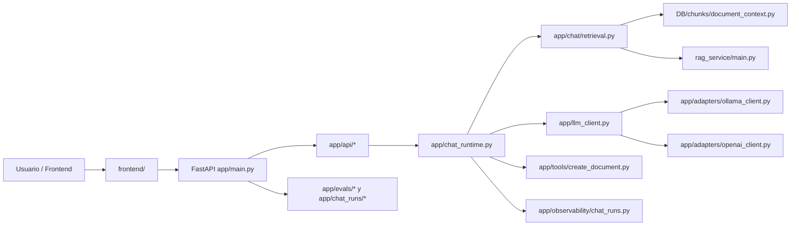

# Arquitectura actual de LOCALES

## Resumen

El sistema principal del repositorio es un backend `FastAPI` que expone `POST /chat` y delega la ejecución real en un runtime de chat. Ese runtime puede:

- resolver proveedor y modelo;
- recuperar contexto documental por RAG local o remoto;
- invocar al modelo;
- aplicar safe refusal cuando no hay evidencia suficiente;
- persistir runs;
- exponer métricas y endpoints de inspección;
- ejecutar la tool `/creardoc`.

También conviven dos subespacios auxiliares:

- `DB/`: laboratorio de persistencia SQLite para LM Studio, separado del runtime principal.
- `llm_lab/`: laboratorio experimental aislado para validación y evaluación de modelos.

## Flujo general

## Componentes principales

| Componente | Ruta principal | Responsabilidad observada |
| --- | --- | --- |
| Gateway HTTP | `app/main.py` | Construye la app, configura CORS e incluye routers. |
| Endpoints API | `app/api/` | Expone `/chat`, modelos, traces, runs y evals. |
| Runtime principal | `app/chat_runtime.py` | Orquesta retrieval, LLM, fallback, tool y persistencia. |
| Fachada de chat | `app/chat/service.py` | Envuelve el runtime con dependencias explícitas. |
| Contratos de entrada/salida | `app/schemas.py` | Define `ChatRequest`, `ChatResponse` y respuestas auxiliares. |
| Resolución de proveedor | `app/llm_client.py` | Valida par `provider/model` y delega al adaptador correcto. |
| Adaptador Ollama | `app/adapters/ollama_client.py` | Llama a Ollama y extrae métricas nativas. |
| Adaptador OpenAI | `app/adapters/openai_client.py` | Llama a OpenAI y devuelve métricas más limitadas. |
| RAG local | `DB/chunks/document_context.py` | Busca chunks en SQLite y construye prompt con contexto. |
| RAG remoto | `rag_service/main.py` + `app/rag_client.py` | Expone y consume un servicio HTTP para retrieval. |
| Observabilidad | `app/observability/` | Genera `trace_id`, logs JSON y persistencia de runs. |
| Evaluación | `app/evals/` + `app/chat_eval_runner.py` | Normaliza runs y calcula métricas operativas. |
| Frontend estático | `frontend/` | Consume backend y muestra chat, runs y stats. |
| Tool documental | `app/tools/create_document.py` | Genera/escribe Markdown en `outputs/documents/`. |

## Qué está más monolítico y qué ya está separado

### Más monolítico

- `app/chat_runtime.py` sigue concentrando demasiado:
  - validación operacional;
  - selección de proveedor/modelo;
  - retrieval;
  - fallback;
  - llamada LLM;
  - tool `/creardoc`;
  - persistencia de runs;
  - logging final de ejecución.

### Más separado

- `app/api/` ya separa exposición HTTP de lógica interna.
- `app/chat/` ya extrae piezas reutilizables:
  - `dependencies.py`
  - `retrieval.py`
  - `fallback.py`
  - `response_builder.py`
  - `service.py`
- `app/adapters/` separa proveedores LLM.
- `rag_service/` separa el modo RAG remoto del backend principal.

## Contratos críticos

### Contrato HTTP principal

- Endpoint público activo: `POST /chat`
- Entrada: `ChatRequest`
- Salida: `ChatResponse`
- Campos especialmente críticos:
  - `trace_id`
  - `provider`
  - `model`
  - `use_rag`
  - `retrieval_status`
  - `answer_mode`
  - `evidence_used`
  - `fallback_used`
  - `chunk_ids`
  - `document_ids`
  - `source_filenames`
  - `warnings`

### Contrato provider/model

- `app/llm_client.py` obliga a que `provider` y `model` sean coherentes.
- Un modelo `gpt-*` no puede ejecutarse con `provider=ollama`.
- Un modelo no OpenAI no puede ejecutarse con `provider=openai`.

### Contrato de retrieval

- Retrieval local y remoto devuelven un payload con forma parecida:
  - `status`
  - `retrieval_status`
  - `prompt`
  - `chunks`
  - `chunk_ids`
  - `document_ids`
  - `source_filenames`
  - `warnings`
- El runtime normaliza `NO_EVIDENCE` a `NO_EVIDENCE_FOR_ANSWER` en la superficie pública.

### Contrato de persistencia de runs

- `app/observability/chat_runs.py` persiste runs como JSON por archivo.
- `app/chat_runs/store.py` y `app/evals/loader.py` vuelven a cargar esos artefactos para métricas y listados.

## Endpoints detectados

### Salud y raíz

- `GET /health`
- `GET /`
- `GET /favicon.ico`

### Chat

- `POST /chat`
- `GET /api/models/chat`
- `GET /api/chat/options`

### Traces y runs

- `GET /api/traces/chat`
- `POST /api/traces/chat/reset`
- `GET /api/chat/runs`
- `GET /api/chat-runs`
- `GET /api/chat-runs/stats`
- `GET /api/chat-runs/{trace_id}`

### Evals y métricas

- `GET /api/evals/chat`
- `GET /api/evals/runs`
- `POST /api/evals/chat/run`
- `GET /api/runs`
- `GET /api/runs/summary`
- `GET /api/runs/timeseries`
- `GET /api/runs/operational-stats`
- `GET /api/runs/by-model/{model_name}`

### Servicio RAG remoto

- `GET /health`
- `GET /rag/health`
- `POST /rag/query`

## Acoplamientos detectados

- `app/main.py` importa directamente `DB.chunks.document_context.build_document_prompt`.
- `app/chat_runtime.py` sigue con imports directos de retrieval, observabilidad, config y tool.
- `rag_service/main.py` reutiliza `DB/chunks/document_context.py`, por lo que el RAG remoto no es un motor independiente.
- `frontend/` conoce endpoints específicos de runs/stats, no solo `/chat`.

## Contradicciones y drift visibles

- Conviven `GET /api/chat/runs` y `GET /api/chat-runs`; es una zona clara de drift funcional.
- Existe `app/observability/chat_trace.py`, pero los routers inspeccionados de traces cargan runs desde `app.observability.chat_runs`.
- `.env.example` sugiere `CHAT_RUNS_PATH=data/chat_runs.jsonl`, pero el cargador actual de runs opera como directorio de JSON por archivo, no como JSONL.

## Estado actual

- Arquitectura principal: monolito operativo con separaciones internas parciales.
- Estado de evolución: hardening, no expansión arquitectónica.
- Evolución razonable: extraer más claramente runtime, contratos y observabilidad sin cambiar `POST /chat`.

## Relacionado

- [[README]]
- [[COMPONENT_MAP]]
- [[RUNTIME_FLOW]]
- [[AGENTIC_EVOLUTION]]
- [[GLOSSARY]]
