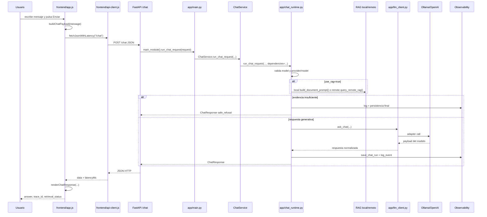

# UI to response

## Resumen

Esta nota sigue el flujo completo desde que el usuario pulsa **Enviar** en la UI hasta que ve una respuesta o un error renderizado en pantalla.

## Actores principales

- [[USER]]
- [[UI]]
- [[FASTAPI]]
- [[CHAT_SERVICE]]
- [[CHAT_RUNTIME]]
- [[RAG]]
- [[LLM_PROVIDER]]
- [[OBSERVABILITY]]

## Diagrama Mermaid

## Pasos numerados

1. La UI recoge `message`, `provider`, `model`, `temperature` y `use_rag` en `frontend/app.js`.
2. `sendChat(...)` construye el payload con `buildChatPayload(...)`.
3. `frontend/api-client.js` resuelve base URL, timeout y auth token.
4. La UI envía `POST /chat`.
5. `app/api/routes_chat.py` valida `ChatRequest` y exige acceso.
6. `app/api/runtime_bridge.py` resuelve `app.main`.
7. `app.main.run_chat_request(...)` crea `ChatService` y `ChatDependencies`.
8. `ChatService` delega en `app/chat_runtime.py`.
9. El runtime genera `trace_id`, valida `model`, resuelve `provider/model` y decide si usa RAG.
10. Si hay RAG, llama a RAG local o remoto.
11. Si no hay evidencia suficiente, devuelve `safe_refusal` sin respuesta libre.
12. Si sí puede generar, llama a `app/llm_client.py`, que delega en Ollama u OpenAI.
13. El runtime construye `ChatResponse`.
14. En `finally`, intenta persistir el run y emitir logs finales.
15. La UI recibe JSON, actualiza panel lateral, evidencia, raw JSON y mensajes renderizados.

## Datos que viajan

### De UI a backend

- `message`
- `provider`
- `model`
- `temperature`
- `use_rag`

### Dentro del runtime

- `trace_id`
- `retrieval_status`
- `query_original`
- `chunk_ids`
- `document_ids`
- `source_filenames`
- `warnings`

### De backend a UI

- `status`
- `provider`
- `model`
- `answer`
- `latency_ms`
- `trace_id`
- `retrieval_status`
- `evidence_used`
- `fallback_used`
- `chunk_ids`
- `source_filenames`

## Módulos implicados

- `frontend/app.js`
- `frontend/api-client.js`

- `app/api/routes_chat.py`: 
	- define una ruta HTTP de FastAPI para el chat. Su trabajo no es “pensar” la respuesta, sino recibir la petición, validar acceso y pasarla al runtime real. El endpoint principal es POST /chat y devuelve un ChatResponse.

- `app/api/runtime_bridge.py`: 
	- dar acceso al módulo principal de la app, app.main, desde la capa API.

- `app/main.py`: 
	- es el centro de arranque de la aplicación FastAPI. Aquí se crea la app, se configuran rutas, CORS y la función que procesa el chat. También deja preparada la lógica que usa app/api/routes_chat.py para ejecutar una petición.

- `app/chat/service.py`
- `app/chat/dependencies.py`
- `app/chat_runtime.py`
- `app/rag_client.py`
- `DB/chunks/document_context.py`
- `app/llm_client.py`
- `app/adapters/ollama_client.py`
- `app/adapters/openai_client.py`
- `app/observability/chat_runs.py`
- `app/observability/logging.py`
- `app/observability/trace.py`

## Puntos de fallo

- UI sin `model` seleccionado;
- base URL inválida;
- `422` por `ChatRequest`;
- `403` por auth;
- `400` por `model_required`;
- `400` por `invalid_provider_model_pair`;
- timeout o caída del proveedor;
- RAG remoto no disponible;
- safe refusal por falta de evidencia;
- fallo al persistir run.

## Evidencia de relaciones

- `call`: `frontend/app.js -> frontend/api-client.js -> /chat`
- `call`: `app/api/routes_chat.py -> app/api/runtime_bridge.py -> app.main`
- `call`: `app/main.py -> app/chat/service.py -> app/chat_runtime.py`
- `call`: `app/chat_runtime.py -> app/rag_client.py` o `DB/chunks/document_context.py`
- `call`: `app/chat_runtime.py -> app/llm_client.py`
- `call`: `app/chat_runtime.py -> app/observability/chat_runs.py`
- `test`: `tests/test_chat_service.py`, `tests/test_remote_rag_service.py`, `tests/test_frontend_api_client_static.py`

## Relacionado

- [[POST_CHAT_FLOW]]
- [[RAG_BRANCH]]
- [[PROVIDER_BRANCH]]
- [[ERROR_AND_FALLBACK_FLOW]]
- [[RUNTIME_GRAPH]]
