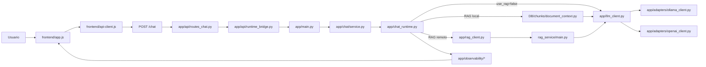

# RUNTIME_GRAPH

## Qué representa

Este grafo resume el camino operativo principal de una petición de chat.

## Mermaid

## Fuente estructural

La base más completa está sintetizada en `docs/runtime_graph.json`.

## Relacionado

- [[STATIC_DEPENDENCY_GRAPH]]
- [[OBSERVED_TRACE_GRAPH]]
- [[UI_TO_RESPONSE]]
